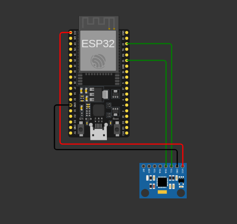

# Actividad: Protocolos de comunicación en IoT y transmisión de datos vía MQTT

## Descripción de la actividad 

A lo largo de esta actividad seréis capaces de analizar, practicar y entender con el proceso de transmisión de datos desde una serie de sensores hacia una plataforma IoT utilizando un protocolo de comunicaciones concreto.  

El caso sobre el que trabajarás es el utilizado en la actividad transversal del título, es decir, el sistema de mantenimiento predictivo de maquinaria usada en procesos productivos. Concretamente, se simulará (con Wokwi) la captura de los datos obtenidos desde un dispositivo ESP32 asociado a un sensor mpu6050 (https://docs.wokwi.com/parts/wokwi-mpu6050) que mide las vibraciones y la temperatura de un motor y su transmisión a una plataforma IoT simulada (Adafruit) mediante protocolo MQTT. Estos dados, después, serán utilizados en otras capas y módulos del proyecto, como, por ejemplo, las de big data. 

## Diagrama de implementación de hardware en Wokwi



## Arquitectura del proyecto

```sh
.
├── LICENSE
├── README.md
├── src
│   └── mpu6050-mqtt
│       ├── CMakeLists.txt
│       ├── dependencies.lock
│       ├── sdkconfig
│       ├── main
│       │   ├── CMakeLists.txt
│       │   ├── mpu6050-mqtt.c
│       │   └── idf_component.yml
│       └── managed_components
│           ├── esp-idf-lib__esp_idf_lib_helpers
│           ├── esp-idf-lib__i2cdev
│           ├── esp-idf-lib__mpu6050
│           └── espressif__mqtt
└── wowki
    ├── diagram.json
    └── wokwi.toml
```

> **Notas:**
> - Se excluye `build/` → es generado automáticamente por `idf.py build`
> - `managed_components/` → dependencias manejadas por el sistema de componentes de ESP-IDF
> - `sdkconfig` → configuración específica del proyecto (puede o no versionarse dependiendo del flujo de trabajo)
> - `wokwi/` → contiene la simulación (Wokwi), separada del firmware real

## Guías de instalación de herramientas y drivers

- Proyecto base de Wokwi: [Wokwi Project Online](https://wokwi.com/projects/461468898633518081)
- Extensión para Visual Studio Code: [Wokwi Extension for VSCode](https://marketplace.visualstudio.com/items?itemName=Wokwi.wokwi-vscode)
- Instalación de ESPRESSIF en Linux: [EIM Installation on Linux](https://docs.espressif.com/projects/esp-idf/en/latest/esp32/get-started/linux-setup.html)
- MPU6050 Driver: [MPU6050 Driver](https://components.espressif.com/components/esp-idf-lib/mpu6050/versions/2.1.9/readme)
- MQTT Protocol: [ESP-MQTT](https://docs.espressif.com/projects/esp-idf/en/stable/esp32/api-reference/protocols/mqtt.html)

