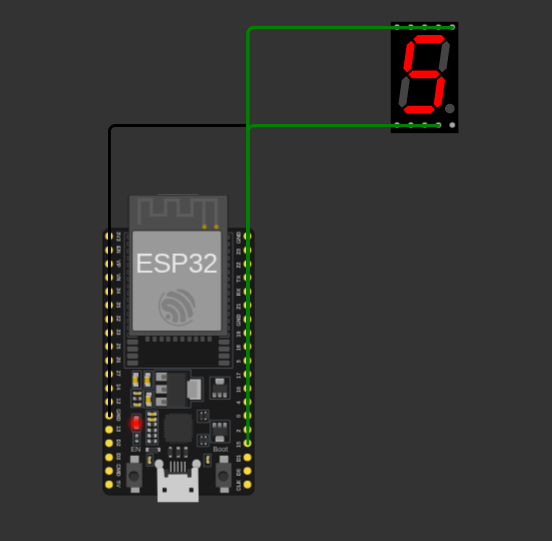
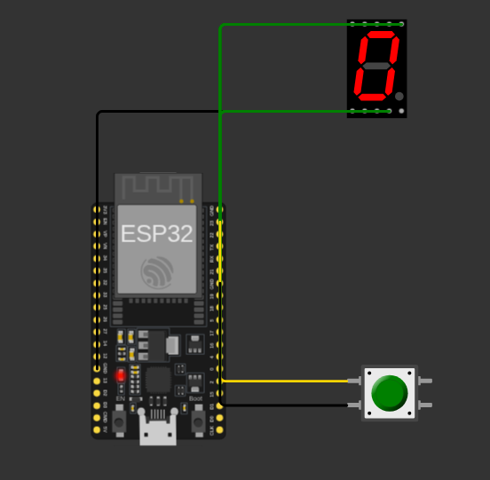

# Actividad: Manejo y programación del *display* de siete segmentos

## Descripción de la actividad

Esta actividad implementa dos ejercicios sobre un *display* de siete segmentos
(cátodo común) gobernado por un ESP32:

1. **Números del nombre** — muestra, cambiando cada segundo, la secuencia de
   dígitos correspondiente a las letras del nombre *JESÚS* según su posición en el
   alfabeto castellano (J=10, E=5, S=20, U=22, S=20 → `1,0,5,2,0,2,2,2,0`).
2. **Dado electrónico** — al pulsar un botón, genera un número aleatorio del 1 al 6
   y lo muestra en el *display*.

El desarrollo se realiza con **ESP-IDF v6.0** y se simula con la **extensión de
Wokwi para VS Code** (no con el IDE web de Wokwi). El código C está documentado con
**Doxygen** y cumple un subconjunto de **MISRA-C:2012**.

## Diagrama de implementación de hardware en Wokwi

> Nombre en Display:
> 
>
> Dado electrónico:
> 

## Arquitectura del proyecto

```
unir-iot-sdrp
├── README.md
├── src
│   ├── nombre-display                 # Ejercicio 2
│   │   ├── CMakeLists.txt
│   │   ├── sdkconfig.defaults
│   │   └── main
│   │       ├── CMakeLists.txt
│   │       ├── nombre-display.c
│   │       ├── seg7.c                  # controlador reutilizable del display
│   │       └── seg7.h
│   └── dado-electronico               # Ejercicio 3
│       ├── CMakeLists.txt
│       ├── sdkconfig.defaults
│       └── main
│           ├── CMakeLists.txt
│           ├── dado-electronico.c
│           ├── seg7.c
│           └── seg7.h
└── wokwi
    ├── nombre-display
    │   ├── diagram.json
    │   └── wokwi.toml
    └── dado-electronico
        ├── diagram.json
        └── wokwi.toml
```

## Compilación y simulación (VS Code + extensión Wokwi)

Para cada proyecto:

```bash
# 1) Compilar el firmware con ESP-IDF v6.0
cd src/nombre-display        # o src/dado-electronico
idf.py build

# 2) Simular: abrir el diagram.json correspondiente en VS Code
#    y ejecutar "Wokwi: Start Simulator".
#    El wokwi.toml apunta a build/<proyecto>.elf y build/<proyecto>.bin
```

## Mapa de conexiones (cátodo común)

| Segmento | GPIO ESP32 |
|:--------:|:----------:|
| A | 15 |
| B | 2  |
| C | 4  |
| D | 5  |
| E | 18 |
| F | 19 |
| G | 21 |
| COM | GND |
| Botón (dado) | 23 (pull-up interno, a GND) |